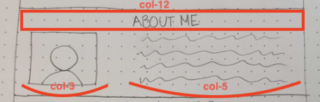
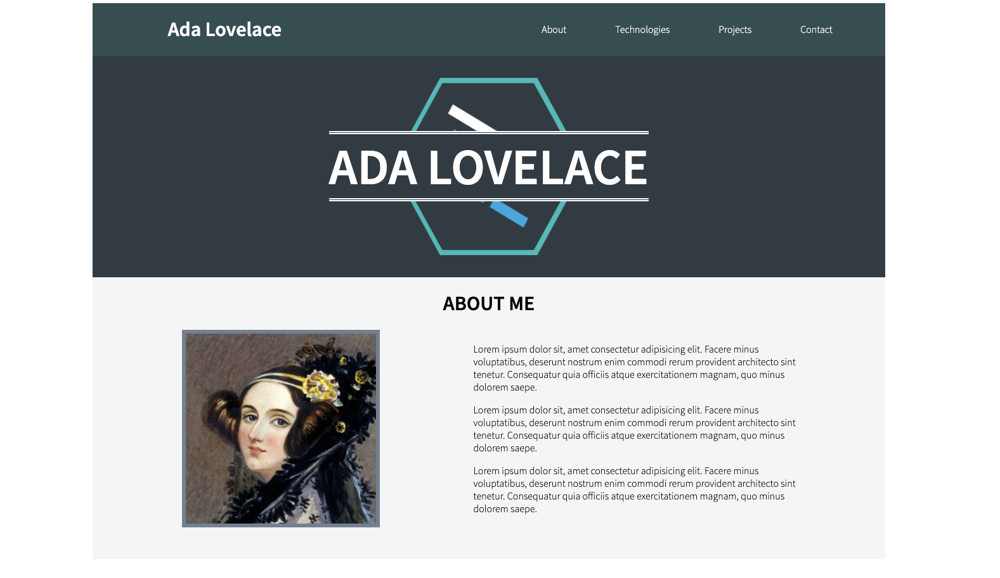

# Portfolio About Me

For our next task, we will be working on building the "About Me" section of the portfolio page. This section will require a photo of you that you feel is a good representation of you and your personality. If it's going to be for a portfolio though, make sure it's professional! Let's take a look at the wireframe we created for the "About Me" section:

<p align="center">
  
</p>

Based on this, we can see that there is a header declaring the purpose of the section which should take up the full width of the available space (`col-12`), an image prominently displayed to the left that takes up about a fourth of the width of the section (col-3), and some text to the right that should be almost half of the available width (`col-5`). Given that there is only a total of 8 columns in the second row of this section, we will need to use that extra space to position the elements to have space evenly spread around them. Let's get started with the HTML necessary to complete this section!

# About Me HTML

1. Below the `div` element you created for the hero image, create another `div` element.
1. Now that we have made our way into a section of the page that there is a link to in the header, we will need to supply an `id` for the element to correlate with the anchor tag in the nav. Add an `id` attribute with a value of "about" to the div element created in the step above.
1. There are a few utility classes that we can apply to this element now, as well. Here is each class we will add to this element, along with the reason for it:
    1. `row`
        - This div will act as a row in the portfolio page.
    1. `justify-evenly`
        - The text and the image in this section have space between them in the wireframe. The `justify-evenly` class will evenly space out any children with extra room around them.
    1. `align-center`
        - This will ensure that the image is centered next to the text in the adjacent space.
    1. `pb-50`
        - This will create some extra room on the bottom of the element to help separate it visually from the section below it.
1. Within the `div` element created above, create a child `h1` element with the text content "ABOUT ME". Based on the wireframe above, we know that this element needs to take up the full width of this element, so apply a class of `col-12` as well.
1. Find a picture of yourself you want to use in your portfolio, and add it to the `assets` folder in your project directory. Please ensure the following things about your image:
    - The image dimensions should be **portrait** rather than **landscape**
    - The image filename should be your first and last name in the following format: `firstname-lastname`
1. As a sibling to the above `h1` element, create an `img` element. Additionally, please set the following attributes on this `img` element:
    - [`alt`](https://www.w3schools.com/tags/att_img_alt.asp) - set to a value of "Your Name Portrait" (make sure to change "Your Name" to your actual name)
    - [`src`](https://www.w3schools.com/tags/att_img_src.asp) - set to a [relative path](https://www.w3schools.com/html/html_filepaths.asp) leading to the image of yourself you added to the `assets` folder
    - `class` - Based on the sizing we decided for the image when examining the wireframe, add a class of `col-3` to set the width of this `img` element.
1. As a sibling to the above `img` element, create a `div` element. This element will be used to hold the text content in this section, so it needs to match the size that was decided upon in the wireframe. Add a class of `col-5` to this element.
1. Inside of the above `div` element, create a `p` element. Inside of this element, write a little bit about yourself. If you want to write multiple paragraphs, use a new sibling `p` element for every new paragraph.

That is all of the new HTML necessary for this section! There are a couple of classes we will need to create styling for though, so let's move into CSS.

# About Me CSS

1. In your `style.css` document, create a new CSS rule-set selecting all elements with a class of `about-section`.
1. In the CSS rule-set you created in the step above, add a `background-color` property with a value of `whitesmoke`.
    - This class will be used to set the background color for this section.
1. Create a new CSS rule-set selecting all elements with a class of `about-image`.
1. In the CSS rule-set you created in the step above, add a `max-height` property with a value of `80%`.
    - This class will be applied to the photo in this section. This property is allowing the image to size itself to a maximum of 80% of the height of the available area. By using `max-height` rather than `height`, we can control images whose size would exceed 80%, but images that would be smaller than 80% can maintain their original size and not be enlarged in any way.
1. Below the above property, add a `border` property with a value of `6px solid slategray`.
    - This border will act as a frame around your image.
1. In your `style.css` document, create a new CSS rule-set selecting all elements with a class of `text-align-reset`.
1. In the CSS rule-set you created in the step above, add a `text-align` property with a value of `initial`.
    - The reason we need this class is because all the text on the entire document is being centered, due to the `text-align-center` class that was applied to the main container `div` in the document. For every other piece of text in the document, centering is what we want. In this specific instance, though, the text should be left-aligned as it would by default, since this section will hold text content meant to be formatted normally for reading. Rather than put an individual `text-align-center` class on every element that needs to be centered, that class can be applied to the main div, and this `text-align-reset` class can be applied to the one element we want to have default text alignment. The `intial` value this property was set to returns the property to whatever it's default value would be, which for the `text-align` property is `left`.

That is all the CSS that is needed for this section, the last remaining step is to apply the classes that were just created to the proper elements in the HTML.

1. Add the `about-section` class to the container div for the About Me section (the one with an `id` set to `about`).
1. Add the `about-image` class to the `img` element in the About Me section.
1. Add the `text-align-reset` class to the `div` element holding the text content in the About Me section.

At this point, you are done with the About Me section! If all went according to plan, your document should now look like this:

<p align="center">
  
</p>

If so, you are ready to move on to the next section: [Technologies](TECH.md). If anything differs from the example above, cross-check your completed code with the code I have provided below before moving on.

# CODE QUALITY CHECK

With every step of this project, I will provide the completed code for what we have written at the bottom of the section as a reference. **PLEASE NOTE** that I am providing this code as a way for you to double check your completed code for each section after having written it. If you choose to copy my code without writing it yourself first, you are doing so at your own peril ☠️

`index.html` thus far:

```html
<!DOCTYPE html>
<html lang="en">

<head>
    <meta charset="UTF-8">
    <meta name="viewport" content="width=device-width, initial-scale=1.0">
    <title>Portfolio</title>
    <link href="https://fonts.googleapis.com/css?family=Source+Sans+Pro:300,600&display=swap" rel="stylesheet">
    <link rel="stylesheet" href="grid.css">
    <link rel="stylesheet" href="style.css">
</head>

<body>
    <div class="container text-align-center">
        <header class="row justify-between align-center white-text page-header">
            <h1 class="col-4">Ada Lovelace</h1>
            <nav class="row col-6 justify-evenly">
                <a href="#about" class="nav-item white-text">About</a>
                <a href="#tech" class="nav-item white-text">Technologies</a>
                <a href="#projects" class="nav-item white-text">Projects</a>
                <a href="#contact" class="nav-item white-text">Contact</a>
            </nav>
        </header>
        <div class="row justify-center align-center white-text hero-image">
            <h1 class="col-12 student-name">ADA LOVELACE</h1>
        </div>
    </div>
    <div id="about" class="row justify-evenly align-center pb-50 about-section">
        <h1 class="col-12">ABOUT ME</h1>
        
        <div class="col-5 text-align-reset">
            <p>Lorem ipsum dolor sit, amet consectetur adipisicing elit. Facere minus voluptatibus, deserunt nostrum enim commodi rerum provident architecto sint tenetur. Consequatur quia officiis atque exercitationem magnam, quo minus dolorem saepe.</p>
            <p>Lorem ipsum dolor sit, amet consectetur adipisicing elit. Facere minus voluptatibus, deserunt nostrum enim commodi rerum provident architecto sint tenetur. Consequatur quia officiis atque exercitationem magnam, quo minus dolorem saepe.</p>
            <p>Lorem ipsum dolor sit, amet consectetur adipisicing elit. Facere minus voluptatibus, deserunt nostrum enim commodi rerum provident architecto sint tenetur. Consequatur quia officiis atque exercitationem magnam, quo minus dolorem saepe.</p>
        </div>
    </div>
</body>

</html>
```

`style.css` thus far:

```css
html {
    font-family: "Source Sans Pro", sans-serif;
}

.text-align-center {
    text-align: center;
}

.white-text {
    color: white;
}

.pb-50 {
    padding-bottom: 50px;
}

.justify-center {
    justify-content: center;
}

.justify-evenly {
    justify-content: space-evenly;
}

.justify-between {
    justify-content: space-between;
}

.align-center {
    align-items: center;
}

.page-header {
    background-color: darkslategrey;
}

.nav-item {
    text-decoration: none;
}

.nav-item:hover {
    color: steelblue;
}

.hero-image {
    background-color: #303b43;
    background-image: url(assets/lfz-logo.png);
    background-position: center;
    background-repeat: no-repeat;
    background-size: auto 80%;
    height: 350px;
}

.student-name {
    font-size: 80px;
    background-color: #303b43;
    border-top: 5px double white;
    border-bottom: 5px double white;
}

.about-section {
    background-color: whitesmoke;
}

.about-image {
    max-height: 80%;
    border: 6px solid slategray;
}

.text-align-reset {
    text-align: initial;
}
```
