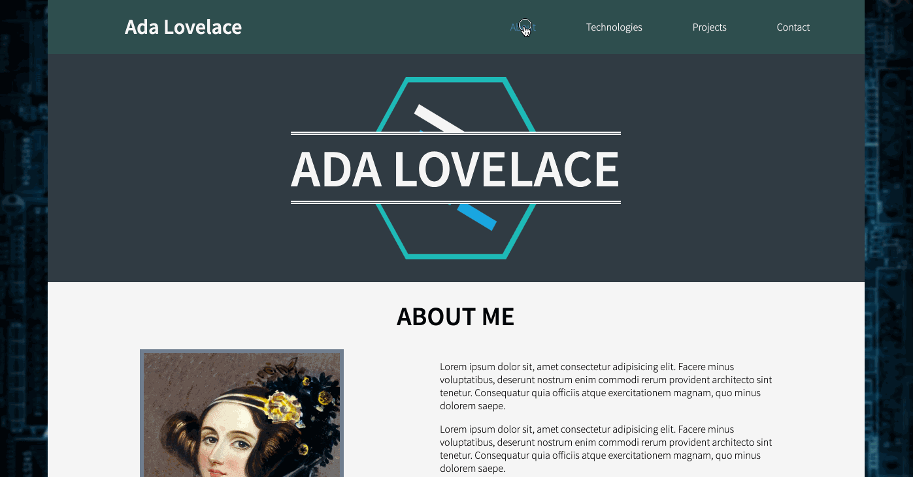

# Portfolio Page Background

For our final task of this project, we will be applying a background image to the portfolio page. Let's take a look at the gif of the completed project to get an idea of how the background image for this section should behave:

<p align="center">
  
</p>

Based on this, we can see that the image doesn't scroll with the page, fills the entire available area, and is centered in the available area. With that, let's get started! This final section will not require any new HTML, so let's dive in to the necessary CSS:

# Portfolio Page Background CSS

To apply this background image, there will need to be a CSS rule-set for the `body` element. Rather than add the rule to the bottom of the `style.css` document we've created thus far, however, let's ensure that the CSS is well organized. Rather than a CSS rule-set targeting all elements with a **class**, there has only been one CSS rule-set previously written by us that is targeting an element's **type**. To keep things organized, this new rule should be added below that **element type** selector created previously, which was for the `html` element.

1. In your `style.css` document, create a new CSS rule-set ___directly below the existing CSS rule-set for the___ `html` ___element___. This new CSS rule-set should be targeting the `body` element.
1. In the CSS rule-set you created in the step above, add a `margin` property with a value of `0`.
    - The body element has an `8px` margin by default. This margin should be removed so that the background image does not have a margin pulling it away from the edges of the page.
1. Below the above property, add a [`background-image`](https://www.w3schools.com/cssref/pr_background-image.asp) property with a value of `url(assets/motherboard-wallpaper.jpg)`.
    - This will apply the background image to the container.
1. Below the above property, add a [`background-size`](https://www.w3schools.com/cssref/css3_pr_background-size.asp) property with a value of `cover`.
    - The `cover` value for the `background-size` property ensures that the image fills the full available area. It does this by setting the smallest side of the image (width or height) to take up 100% of the available area, and chops off the excess portion of the image on the larger side.
1. Below the above property, add a [`background-attachement`](https://www.w3schools.com/cssref/pr_background-attachment.asp) property with a value of `fixed`.
    - This will force the background image to not scroll with the rest of the page.

And that's it for the background image!! There's one more piece of styling that can be applied to this to up the coolness factor by a bit, though:

1. Within the existing CSS rule-set for the `html` element, add a [`scroll-behavior`](https://www.w3schools.com/cssref/pr_scroll-behavior.asp) property with a value of `smooth`.
    - This will make any anchor tags that are navigating to an `id` within the current document have a smooth scroll to that point rather than jumping directly to it. This is a newer property that is not very well incorporated across all browsers yet, but where it does work, a smooth scroll can really improve the transition between sections of your page for your users!

And with that, the Portfolio project is complete! Congratulations!!!

<p align="center">
  
</p>

If your document's behavior differs in any way from the example gif provided above, please consult the completed code provided below to compare against your code.

# CODE QUALITY CHECK

With every step of this project, I will provide the completed code for what we have written at the bottom of the section as a reference. **PLEASE NOTE** that I am providing this code as a way for you to double check your completed code for each section after having written it. If you choose to copy my code without writing it yourself first, you are doing so at your own peril ☠️

Completed `index.html`:

```html
<!DOCTYPE html>
<html lang="en">

<head>
    <meta charset="UTF-8">
    <meta name="viewport" content="width=device-width, initial-scale=1.0">
    <title>Portfolio</title>
    <link href="https://fonts.googleapis.com/css?family=Source+Sans+Pro:300,600&display=swap" rel="stylesheet">
    <link rel="stylesheet" href="grid.css">
    <link rel="stylesheet" href="style.css">
</head>

<body>
    <div class="container text-align-center">
        <header class="row justify-between align-center white-text page-header">
            <h1 class="col-4">Ada Lovelace</h1>
            <nav class="row col-6 justify-evenly">
                <a href="#about" class="nav-item white-text">About</a>
                <a href="#tech" class="nav-item white-text">Technologies</a>
                <a href="#projects" class="nav-item white-text">Projects</a>
                <a href="#contact" class="nav-item white-text">Contact</a>
            </nav>
        </header>
        <div class="row justify-center align-center white-text hero-image">
            <h1 class="col-12 student-name">ADA LOVELACE</h1>
        </div>
    </div>
    <div id="about" class="row justify-evenly align-center pb-50 about-section">
        <h1 class="col-12">ABOUT ME</h1>
        
        <div class="col-5 text-align-reset">
            <p>Lorem ipsum dolor sit, amet consectetur adipisicing elit. Facere minus voluptatibus, deserunt nostrum enim commodi rerum provident architecto sint tenetur. Consequatur quia officiis atque exercitationem magnam, quo minus dolorem saepe.</p>
            <p>Lorem ipsum dolor sit, amet consectetur adipisicing elit. Facere minus voluptatibus, deserunt nostrum enim commodi rerum provident architecto sint tenetur. Consequatur quia officiis atque exercitationem magnam, quo minus dolorem saepe.</p>
            <p>Lorem ipsum dolor sit, amet consectetur adipisicing elit. Facere minus voluptatibus, deserunt nostrum enim commodi rerum provident architecto sint tenetur. Consequatur quia officiis atque exercitationem magnam, quo minus dolorem saepe.</p>
        </div>
    </div>
    <div id="tech" class="row justify-evenly pb-50 tech-section">
        <h1 class="col-12">TECHNOLOGIES</h1>
        
        
        
    </div>
    <div id="projects" class="row justify-evenly pb-50 projects-section">
        <h1 class="col-12">MY PROJECTS</h1>
        
        
        
    </div>
    <div id="contact" class="row justify-center white-text pb-50 contact-section">
        <h1 class="col-12">CONTACT ME</h1>
        <p class="col-12">Find more of my work on <a href="" class="nav-item blue-text">GitHub</a></p>
    </div>
</body>

</html>
```

Completed `style.css`:

```css
html {
    font-family: "Source Sans Pro", sans-serif;
    scroll-behavior: smooth;
}

body {
    margin: 0;
    background-image: url(assets/motherboard-wallpaper.jpg);
    background-size: cover;
    background-position: center;
    background-attachment: fixed;
}

.text-align-center {
    text-align: center;
}

.white-text {
    color: white;
}

.pb-50 {
    padding-bottom: 50px;
}

.justify-center {
    justify-content: center;
}

.justify-evenly {
    justify-content: space-evenly;
}

.justify-between {
    justify-content: space-between;
}

.align-center {
    align-items: center;
}

.page-header {
    background-color: darkslategrey;
}

.nav-item {
    text-decoration: none;
}

.nav-item:hover {
    color: steelblue;
}

.hero-image {
    background-color: #303b43;
    background-image: url(assets/lfz-logo.png);
    background-position: center;
    background-repeat: no-repeat;
    background-size: auto 80%;
    height: 350px;
}

.student-name {
    font-size: 80px;
    background-color: #303b43;
    border-top: 5px double white;
    border-bottom: 5px double white;
}

.about-section {
    background-color: whitesmoke;
}

.about-image {
    max-height: 80%;
    border: 6px solid slategray;
}

.text-align-reset {
    text-align: initial;
}

.tech-section {
    background-color: gainsboro;
}

.projects-section {
    background-color: snow;
}

.contact-section {
    background-color: #303b43;
}

.blue-text {
    color: lightblue;
}
```
