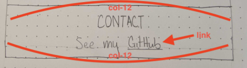
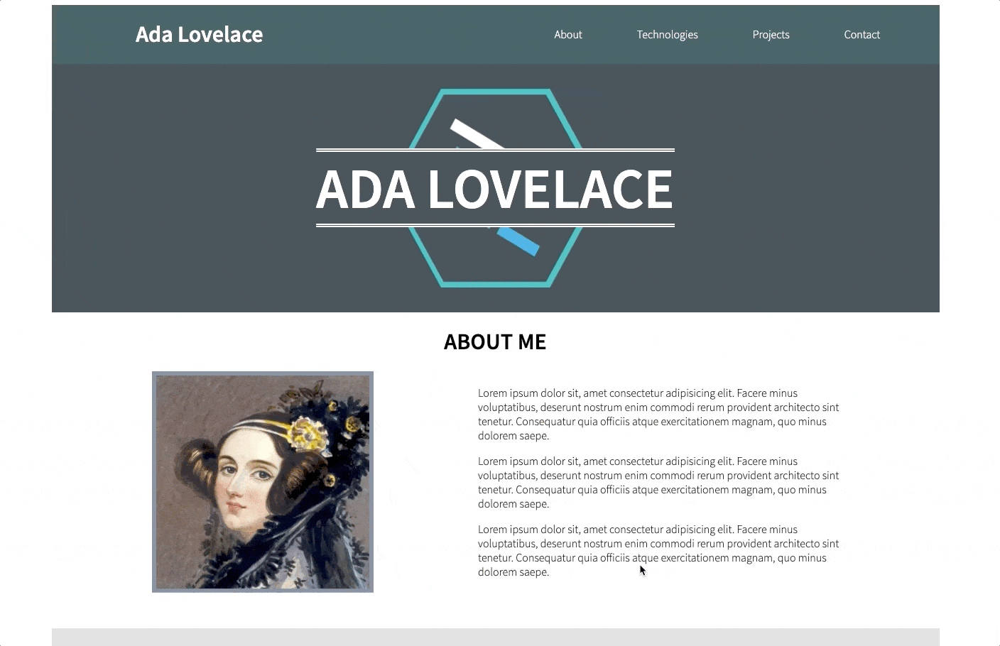

# Portfolio Contact Section

For our next task, we will be working on building the "Contact" section of the portfolio page. Let's take a look at the wireframe that was made for this section:

<p align="center">
  
</p>

Based on this, we can see that there is a header declaring the purpose of the section which should take up the full width of the available space (col-12), and one other text element that includes a link to your GitHub profile. That text element is also taking up the full width of the available area, so it will receive a column measure of `col-12` as well. There is a little bit of CSS to build before we tackle the HTML though, so let's jump on that!

# Contact CSS

1. In your `style.css` document, create a new CSS rule-set selecting all elements with a class of `contact-section`.
1. In the CSS rule-set you created in the step above, add a `background-color` property with a value of `#303b43`.
    - This class will be used to set the background color for this section.
1. Below the CSS rule-set created in the step above, create a new CSS rule-set selecting all elements with a class of `blue-text`.
1. In the CSS rule-set you created in the step above, add a `color` property with a value of `lightblue`.
    - This class will be used to set the font color for the anchor tag linking to your GitHub profile in this section. The text will all be set to have a white text color and the default link underline will be removed to keep the link stylistically similar to the links in the navbar, so we need another text color to differentiate our link from the surrounding text.

With that, the necessary CSS for this section is done, and we can move on to the HTML!

# Contact HTML

1. Below the `div` element you created for the Projects section, create another `div` element.
1. This section has a link in the navbar as well, so we will need to supply an `id` for the element to correlate with the anchor tag in the nav. Add an `id` attribute with a value of "contact" to the div element created in the step above.
1. Since the CSS is already done for this section, we can apply all necessary classes to this element now! Here is each class we will add to this element, along with the reason for it:
    1. `row`
        - This div will act as a row in the portfolio page.
    1. `justify-center`
        - The `justify-center` class will center all text content in this element.
    1. `pb-50`
        - This will create some extra room on the bottom of the element to help separate it visually from the section below it.
    1. `white-text`
        - This will set all text in this element to have a white text color.
    1. `contact-section`
        - This will apply the proper background color to this section.
1. Within the `div` element created above, create a child `h1` element with the text content "CONTACT ME". Based on the wireframe above, we know that this element needs to take up the full width of this element, so apply a class of `col-12` as well.
1. Below the above `h1` element, create a `p` element with the text content "Find more of my work on GitHub". Based on the wireframe above, we know that this element needs to take up the full width of this element, so apply a class of `col-12` as well.
1. ***INSIDE*** of the above `p` element, create an `a` element whose opening tag is right before the word "GitHub", and whose closing tag is right after the word "GitHub". This anchor tag should be completely within the `p` tag created above. On this anchor tag, please set the following attributes:
    - [`href`](https://www.w3schools.com/tags/att_a_href.asp) - set to a value of the url to your GitHub user profile. Your url will fit the following format: `https://github.com/username`. Replace "username" in the url with your actual GitHub username.
    - `class` - This will be a navigation link in our page, so we should reuse the `nav-item` class that was made previously for the navbar. Additionally, apply the class `blue-text` so that the text color on the link will stand out from the surrounding text.

With that, your HTML for the portfolio is complete! If you open your page in the browser, you should see the following:

<p align="center">
  
</p>

If you see the above, you completed the Contact section successfully! There is still one component left to complete, however, if you look back to the gif of the completed product:

<p align="center">
  
</p>

Let's move to the final section of this project where we can give the portfolio page a [background image](BACKGROUND.md). If anything differs on your page from the completed Contact section example above, cross-check your completed code with the code I have provided below before moving on.

# CODE QUALITY CHECK

With every step of this project, I will provide the completed code for what we have written at the bottom of the section as a reference. **PLEASE NOTE** that I am providing this code as a way for you to double check your completed code for each section after having written it. If you choose to copy my code without writing it yourself first, you are doing so at your own peril ☠️

`index.html` thus far:

```html
<!DOCTYPE html>
<html lang="en">

<head>
    <meta charset="UTF-8">
    <meta name="viewport" content="width=device-width, initial-scale=1.0">
    <title>Portfolio</title>
    <link href="https://fonts.googleapis.com/css?family=Source+Sans+Pro:300,600&display=swap" rel="stylesheet">
    <link rel="stylesheet" href="grid.css">
    <link rel="stylesheet" href="style.css">
</head>

<body>
    <div class="container text-align-center">
        <header class="row justify-between align-center white-text page-header">
            <h1 class="col-4">Ada Lovelace</h1>
            <nav class="row col-6 justify-evenly">
                <a href="#about" class="nav-item white-text">About</a>
                <a href="#tech" class="nav-item white-text">Technologies</a>
                <a href="#projects" class="nav-item white-text">Projects</a>
                <a href="#contact" class="nav-item white-text">Contact</a>
            </nav>
        </header>
        <div class="row justify-center align-center white-text hero-image">
            <h1 class="col-12 student-name">ADA LOVELACE</h1>
        </div>
    </div>
    <div id="about" class="row justify-evenly align-center pb-50 about-section">
        <h1 class="col-12">ABOUT ME</h1>
        
        <div class="col-5 text-align-reset">
            <p>Lorem ipsum dolor sit, amet consectetur adipisicing elit. Facere minus voluptatibus, deserunt nostrum enim commodi rerum provident architecto sint tenetur. Consequatur quia officiis atque exercitationem magnam, quo minus dolorem saepe.</p>
            <p>Lorem ipsum dolor sit, amet consectetur adipisicing elit. Facere minus voluptatibus, deserunt nostrum enim commodi rerum provident architecto sint tenetur. Consequatur quia officiis atque exercitationem magnam, quo minus dolorem saepe.</p>
            <p>Lorem ipsum dolor sit, amet consectetur adipisicing elit. Facere minus voluptatibus, deserunt nostrum enim commodi rerum provident architecto sint tenetur. Consequatur quia officiis atque exercitationem magnam, quo minus dolorem saepe.</p>
        </div>
    </div>
    <div id="tech" class="row justify-evenly pb-50 tech-section">
        <h1 class="col-12">TECHNOLOGIES</h1>
        
        
        
    </div>
    <div id="projects" class="row justify-evenly pb-50 projects-section">
        <h1 class="col-12">MY PROJECTS</h1>
        
        
        
    </div>
    <div id="contact" class="row justify-center white-text pb-50 contact-section">
        <h1 class="col-12">CONTACT ME</h1>
        <p class="col-12">Find more of my work on <a href="" class="nav-item blue-text">GitHub</a></p>
    </div>
</body>

</html>
```

`style.css` thus far:

```css
html {
    font-family: "Source Sans Pro", sans-serif;
}

.text-align-center {
    text-align: center;
}

.white-text {
    color: white;
}

.pb-50 {
    padding-bottom: 50px;
}

.justify-center {
    justify-content: center;
}

.justify-evenly {
    justify-content: space-evenly;
}

.justify-between {
    justify-content: space-between;
}

.align-center {
    align-items: center;
}

.page-header {
    background-color: darkslategrey;
}

.nav-item {
    text-decoration: none;
}

.nav-item:hover {
    color: steelblue;
}

.hero-image {
    background-color: #303b43;
    background-image: url(assets/lfz-logo.png);
    background-position: center;
    background-repeat: no-repeat;
    background-size: auto 80%;
    height: 350px;
}

.student-name {
    font-size: 80px;
    background-color: #303b43;
    border-top: 5px double white;
    border-bottom: 5px double white;
}

.about-section {
    background-color: whitesmoke;
}

.about-image {
    max-height: 80%;
    border: 6px solid slategray;
}

.text-align-reset {
    text-align: initial;
}

.tech-section {
    background-color: gainsboro;
}

.projects-section {
    background-color: snow;
}

.contact-section {
    background-color: #303b43;
}

.blue-text {
    color: lightblue;
}
```
