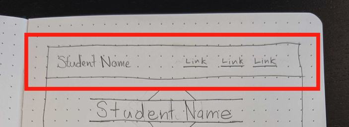

# Portfolio Header

Now that we have narrowed the focus of the planning to individual sections, let's begin working on the first section of the application, the header:

<p align="center">
  
</p>

In the structure of the header, we have four text elements, with one placed against the left side of the row, and three placed against the right side of the row with a little space between them. There are multiple different ways we could accomplish this layout, but we want to find the [path of least resistance](https://en.wikipedia.org/wiki/Path_of_least_resistance).

Rather than trying to force this layout using margin, padding, positioning, or other forceful ways to push an element around, we want to create a design that achieves this effect based on sizing the elements appropriately and consistently. One of the best ways we can accomplish this is using a [grid system](https://github.com/Learning-Fuze/lfz-lessons/tree/master/exercises/css-basic-grid). Let's start by breaking up the internal elements of this section into the containers we want to group the elements into.

Viewing the model for this section, we can see one distinct groupings of elements that would be a perfect use of a container to surround them:

<p align="center">
  
</p>

These nav elements are all going to be distinct elements, but they have all been moved as a group towards the right-hand side of the section. We could position each of these elements individually, but that would make this a much more intense task. If we consider the group of elements as one whole, however, we now have a situation where we need one element to sit against the left edge of the row, and one container to sit against the right edge of the section. This is much easier!

<p align="center">
  
</p>

For the sake of the application, we will be using a grid system with **12 columns**. As such, we can now start to consider the size the elements should take up. The "Student Name" headline and nav element container do not take up all of the available space on the row, so we should be leaving some extra space in their sizing. The nav container is taking up about half of the row, so it should take up **6 columns** of the total twelve columns. Finally, the headline with your name will take **4 columns**, which leaves us with **2 columns** left over to use as **space between** the elements. Now that we have a plan of action, we can begin coding this section out!!

# Basic HTML structure

In your code editor, please do the following:

1. Create an empty `style.css` file and an empty `index.html` file.
1. Add an HTML skeleton to your `index.html`.
1. In the `head` element of your `index.html`, please paste in the following link element that will add a font family from Google Fonts that we can use in our document:
```html
  <link href="https://fonts.googleapis.com/css?family=Source+Sans+Pro:300,600&display=swap" rel="stylesheet">
```
1. Below the above link element, add a `link` element linking to the `grid.css` file included with the content for this project, as well as a link to your `style.css` file.
    - **NOTE**: Please make sure that the order of your `link` elements is the font link pasted from above, `grid.css`, then `style.css` to ensure proper load order.
1. Look at the contents of the `grid.css` file. You will notice that this is the same grid provided by us for the grid exercise you completed previously.
1. Within the `body` element, add a `div` element with a class of `container`. This element will serve as the wrapper for all of the content of the page.
1. Within the `div`, please add a `header` element with a class of `row`. This element is a [semantic element](https://www.w3schools.com/html/html5_semantic_elements.asp) which describes its content as "header" content. This element will serve as the container for all of the header content, and the `row` class will declare this element to be a row in the grid system of the document.
1. Give the `header` element a child `h1` element and a child `nav` element.
    - The text content of the `h1` should be your full name.
1. Give the `h1` element you just created the class `col-4`. This will set up the name headline to take up the four columns we determined it should take up in its row.
1. Give the `header` element another child of a [`nav` element](https://www.w3schools.com/tags/tag_nav.asp).
    - The `nav` element here will serve as the container for the group of anchor tags to link to sections in the document. Since these elements are being used for navigation, a `nav` element is the proper semantic choice of element to describe its purpose as well as a proper choice of element to contain these elements.
1. Give the `nav` element a class of `col-6` to establish the sizing we mentioned for it above. Additionally, give this element a class of `row`, because it will hold its own child elements that will have column measurements, which makes it a row in our grid system as well.
1. Give the `nav` element four child `a` elements. These elements should have the following configurations:
    - First `a` element:
      - text content: `About`
      - attributes:
        - href: `"#about"`
    - Second `a` element:
      - text content: `Technologies`
      - attributes:
        - href: `"#tech"`
    - Third `a` element:
      - text content: `Projects`
      - attributes:
        - href: `"#projects"`
    - Fourth `a` element:
      - text content: `Contact`
      - attributes:
        - href: `"#contact"`
    - **NOTE:** The `href` attribute values in the `a` elements we just created do not link to an external location, but actually scrolls the page to the `id` provided. These `id`s do not exist yet, but we will make them as we continue with this project.

And that's it for the HTML we need to write for this section! We will return to the html to add some classes later, but for now, we can move into preparing the CSS we will be applying to the elements.

# CSS Basic Setup

To begin the CSS, we will apply the font family that was imported from Google Fonts to all of the text in our document.

1. In your `style.css` document, create a new CSS rule-set selecting the `html` element. Within that rule, set the `font-family` property to have a value of `"Source Sans Pro", sans-serif`. This will set all text to have a font family of "Source Sans Pro", with a fallback font family of `sans-serif` just in case the intended font family cannot be used for some reason.

Next, we will be creating some utility classes! In CSS, a utility class is a class that is made to be reused, and usually only applies styling to one or two properties. These classes are named ***functionally*** rather than ***semantically***.

For instance, if you create a class to apply style to the header for a section of your page listing items for sale, you may title that class something like `product-list-header`; this class name would be an example of a ***semantic*** class name, since it describes the content that will receive the styling you are creating. By contrast, if you were making a utility class, the class name should describe its ***function*** rather than what will receive that styling, so that you can easily reuse this class wherever it is applicable.

For example, a utility class might be something like this:

```css
.text-align-center {
    text-align: center;
}
```

Notice that the name of the class does not hint at any content it would be influencing, it simply describes the function that the class is used for. By keeping the name of the class related to its functionality rather than what it is being applied to, we can now use this class anywhere we might want to in our document.

1. Below the CSS rule-set we wrote for the step above, create a new CSS rule-set selecting all elements with a class of `text-align-center`. Within that rule, set the `text-align` property to have a value of `center`.
    - This is an example of a "utility class". Notice that the class name does not describe what element will receive this styling, but rather describes the styling applied to that class, so that the class can be applied to any element we want to use that styling on and immediately understand what that class is doing.
1. Create a new CSS rule-set selecting all elements with a class of `white-text`. Within that rule, set the `color` property to have a value of `white`.
1. Create a new CSS rule-set selecting all elements with a class of `pb-50`. Within that rule, set the `padding-bottom` property to have a value of `50px`.
    - This is an example of a utility class designed to make use of an abbreviation to describe the property and value being set. Alternatively, we could make the class name something like `padding-bottom-50`, but that is getting pretty lengthy, so by using the abbreviation `pb-50`, we can provide the same information describing the class's effect in far fewer characters.

The rest of the utility classes we will make for this section are meant to work in conjunction with the grid system, which is built using `Flexbox`. While the grid system provides all of the classes we will need for sizing, we will need some classes for positioning items using "flexbox" within their rows in the grid.

1. Create a new CSS rule-set selecting all elements with a class of `justify-center`. Within that rule, set the `justify-content` property to have a value of `center`.
  - The [`justify-content`](https://www.w3schools.com/cssref/css3_pr_justify-content.asp) property controls placement of child elements in FlexBox elements along the primary axis, which is the X axis (horizontal) by default.
1. Create a new CSS rule-set selecting all elements with a class of `justify-evenly`. Within that rule, set the `justify-content` property to have a value of `space-evenly`.
1. Create a new CSS rule-set selecting all elements with a class of `justify-between`. Within that rule, set the `justify-content` property to have a value of `space-between`.
1. Create a new CSS rule-set selecting all elements with a class of `align-center`. Within that rule, set the `align-items` property to have a value of `center`.
  - The [`align-items`](https://www.w3schools.com/cssref/css3_pr_align-items.asp) property controls placement of child elements in FlexBox elements along the cross axis, which is the Y axis (vertical) by default.

And that's it for the utility classes we will need for this section! There are still a couple minor classes we need to make styling for, but these will be `semantic classes` that are named for the element they will be being applied to rather than the functionality they provide.

1. Create a new CSS rule-set selecting all elements with a class of `page-header`. Within that rule, set the `background-color` property to have a value of `darkslategray`. This class will be applied to the container for our entire header section to give it the background color we want it to have!
1. Create a new CSS rule-set selecting all elements with a class of `nav-item`. Within that rule, set the `text-decoration` property to have a value of `none`. This class will be applied to all links in our document to remove the default underline and make our link look more clean.
1. Create a new CSS rule-set selecting all elements with a class of `nav-item` ___AND___ the [pseudoclass](https://www.w3schools.com/css/css_pseudo_classes.asp) `hover`. Within that rule, set the `color` property to have a value of `steelblue`. This is a special piece of styling that will be applied by the browser when an element with the `nav-item` class is being hovered by the user, and will change the text color while it is being hovered. Since we changed the default color and look of our links, we need a visual indicator that the element is a link when a user interacts with it; this will serve that role.

That is all the styling we will need to complete the header section of our document!! That may have felt like a lot of CSS to write for just one section, but most of the styling we just wrote was utility classes that we will be able to reuse throughout our document. Believe it or not, nearly half of the CSS for your entire document is now complete! Utility classes do require forethought and planning, but they allow us to do quite a lot with not a lot of code. Now that the CSS has been written for this section, let's move on to updating the HTML we wrote in the step above.

# Updating HTML with CSS classes

Now that we have the classes we needed to make to complete this section, let's go back and apply them to the elements in question to get that styling we were looking for!

1. Add the class `text-align-center` to the div with a class of `container`. The `text-align` property is an [inheritable](https://developer.mozilla.org/en-US/docs/Learn/CSS/Building_blocks/Cascade_and_inheritance#Inheritance) property in CSS, which means that any value applied to it can be used by all child elements in that element, if the property hasn't been given a value on that child element already. We want all of the text in the portfolio to be centered (with one tiny exception we will deal with later), which means that by applying this styling to the container, we can avoid having to put a `text-align-center` class on every text element, because they can just use the inherited styling they received from the `.container` ancestor element. Pretty neat!!
1. Next, we will add a few additional classes to the `header` element.
  - Looking back to the wireframe we created above, you will recall that we decided that there should be some space between the nav and the heading. Add the class `justify-between` so that any extra space is placed in between the child elements of the header element.
    - **NOTE:** When using Flexbox, it is important to remember that all properties which affect the behavior of child elements within a container are applied to the container and not directly on the child elements. Here, we want to put space between your name heading and the nav links, so we apply this class to the `header` element, because it is the parent of these elements, and it will be the Flexible Box that will control the child elements' behavior.
  - On the same note, we also want content in the `header` element to be centered vertically. Add the `align-center` class to accomplish this.
  - Add a class of `white-text` to make the text white in this element.
  - Add the class `page-header` to the `header `element to set the background color for the content.
1. Next we will adjust the `nav` element. It would be nice to have an even amount of space between all of the links, so we will add the `justify-evenly` class to the `nav` element to get this behavior.
1. Finally, we want to make the nav links all have white text, remove their underline, and add the change in text color on hover. To do this, add the `white-text` and `nav-item` class to every `a` element in the `nav` element.

And that's it!! So far, your document should look like this:

<p align="center">
  
</p>

If so, you are prepared to move on to the next section, the [Hero Image](HERO_IMG.md)!

# CODE QUALITY CHECK

With every step of this project, I will provide the completed code for what we have written at the bottom of the section as a reference. **PLEASE NOTE** that I am providing this code as a way for you to double check your completed code for each section after having written it. If you choose to copy my code without writing it yourself first, you are doing so at your own peril ☠️

`index.html` thus far:

```html
<!DOCTYPE html>
<html lang="en">

<head>
    <meta charset="UTF-8">
    <meta name="viewport" content="width=device-width, initial-scale=1.0">
    <title>Portfolio</title>
    <link href="https://fonts.googleapis.com/css?family=Source+Sans+Pro:300,600&display=swap" rel="stylesheet">
    <link rel="stylesheet" href="grid.css">
    <link rel="stylesheet" href="style.css">
</head>

<body>
    <div class="container text-align-center">
        <header class="row justify-between align-center white-text page-header">
            <h1 class="col-4">Ada Lovelace</h1>
            <nav class="row col-6 justify-evenly">
                <a href="#about" class="nav-item white-text">About</a>
                <a href="#tech" class="nav-item white-text">Technologies</a>
                <a href="#projects" class="nav-item white-text">Projects</a>
                <a href="#contact" class="nav-item white-text">Contact</a>
            </nav>
        </header>
    </div>
</body>

</html>
```

`style.css` thus far:

```css
html {
    font-family: "Source Sans Pro", sans-serif;
}

.text-align-center {
    text-align: center;
}

.white-text {
    color: white;
}

.pb-50 {
    padding-bottom: 50px;
}

.justify-center {
    justify-content: center;
}

.justify-evenly {
    justify-content: space-evenly;
}

.justify-between {
    justify-content: space-between;
}

.align-center {
    align-items: center;
}

.page-header {
    background-color: darkslategrey;
}

.nav-item {
    text-decoration: none;
}

.nav-item:hover {
    color: steelblue;
}
```
