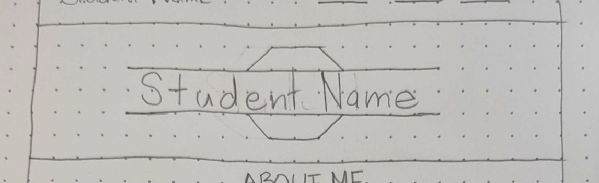
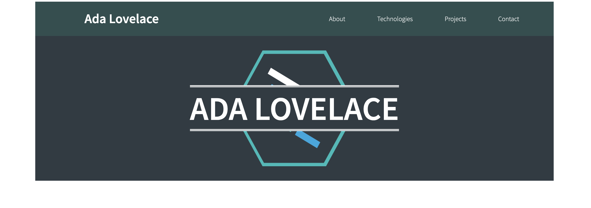

# Portfolio Hero Image

For our next task, we will be working on building the [hero image](https://en.wikipedia.org/wiki/Hero_image) for the portfolio page. In the case of a portfolio, the central thing we want people to know is the name of the person whose portfolio they are looking at, so it will be placed prominently on the image that draws a user's attention when they first view the page. Let's take a look at the wireframe we constructed for this section:

<p align="center">
  
</p>

Given this wireframe, there are a few points we can make note of about what needs to be accomplished here:

- There is an image background in the section
- There is a text element overlaying that image
- The text element is centered both horizontally and vertically over the image
- The text element has a border on the top and bottom of the element

Now that the tasks that need to be accomplished are clear, we can start laying out our HTML for this section, which should be pretty simple.

# Hero Image HTML

1. As a sibling element to the `header` element, create a `div` element. Since the hero image will be a row in our document grid system, give the `div` a class of `row`.
1. As a child of the above `div` element we created, create an `h1` element. We want this text element to take up the full width of the hero image row, so please add a class of `col-12`. This will make the element span the full twelve columns of the grid system.
1. Make the text content of the above `h1` element your full name in all capital letters.

And that is all of the new HTML elements we will need for this section! Before we move on to writing CSS for this portion, though, there are some utility classes we can add to these elements that we already made in the process of creating the Header. Looking back to the objectives that were determined above for this section, we know that the text element needs to be centered horizontally and vertically. Thankfully, there are classes for each of these already!

1. On the `div` element created in this section, add the classes `justify-center` and `align-center`. Since this is using Flexbox, the div is in control of the behavior of the child element, so these classes will make any child element(s) be centered both horizontally and vertically.
1. This section will have white text, so also add the class `white-text` to the div element.

There is still some styling that we need to apply to these elements, namely the background image and the borders on the text element. This styling will be very specific to these elements, so we will create some **semantic** classes for each element to contain that styling.

# Hero Image CSS

The first thing we need to do is add the background image to this section. In order to do that, we will need to set the value for a few properties that correlate with `background-image` to control the behavior of the image we are going to use as the background. Take a look now at the image we will be using as the background for this section:

<p align="center">
  
</p>
<p align="center"><code>lfz-logo.png</code> in the assets folder included with this project</p>

The image has a transparent background, and is much larger than we want it to be given the example of our completed project we saw previously:

<p align="center">
  
</p>

Based on this, we know a couple things that we will need to do to this background image:

- Set a size for the image to control how much space it takes up
- Set a background color for the section since the image is transparent
- Position the image at the center of the available area in the element
- Ensure that the image doesn't repeat within the extra available space

Since this styling will be highly unique to the hero image element, we will create a **semantic** class for the hero image container.

1. In your `style.css` document, create a new CSS rule-set selecting all elements with a class of `hero-image`.
1. In the CSS rule-set you created in the step above, add a [`background-image`](https://www.w3schools.com/cssref/pr_background-image.asp) property with a value of `url(assets/lfz-logo.png)`.
    - This will apply the background image to the container.
1. Below the above property, add a [`background-color`](https://www.w3schools.com/cssref/pr_background-color.asp) property with a value of `#303b43`.
    - This will provide the color backdrop we want behind our image, since it has a transparent background.
1. Below the above property, add a [`background-position`](https://www.w3schools.com/cssref/pr_background-position.asp) property with a value of `center`.
    - This will center the background image in its container.
1. Below the above property, add a [`background-repeat`](https://www.w3schools.com/cssref/pr_background-repeat.asp) property with a value of `no-repeat`.
    - This will ensure that the image does not repeat.
1. Below the above property, add a [`background-size`](https://www.w3schools.com/cssref/css3_pr_background-size.asp) property with a value of `auto 80%`.
    - This is affecting how large the image will be in the element it is a background for. The property itself can receive a few different types of values, but here we are setting the width and the height of the element. The goal is for the image to fit in its container with a little room on the top and bottom. Because of this, we want to set the height value for the image, and let the width be automatic to preserve the image's aspect ratio.
1. Below the above property, add a `height` property with a value of `350px`.
    - This is one of the rare cases where setting a height on the element is okay. Because we want this element to have a larger height than the text element within it will take up, we need a set size for the element so that the `h1` element has room to be positioned within.

And that's it for the background image! We still have one more semantic class to create though, for the `h1` with your name in it.

1. In your `style.css` document, create a new CSS rule-set selecting all elements with a class of `student-name`.
1. In the CSS rule-set you created in the step above, add a `font-size` property with a value of `80px`.
    - The title in this section requires larger text than the default `h1` styling, so we are increasing it here.
1. Below the above property, add a `background-color` property with a value of `#303b43`.
    - This is the same background color as we have for the background of the hero image. By doing this, we can have a stripe of the same color behind the text of the element, making it seem as though it is also a part of the background.
1. Below the above property, add a `border-top` property with a value of `5px double white`.
1. Below the above property, add a `border-bottom` property with a value of `5px double white`.
    - The above two steps set up the border above and below your name.

And that's all of the CSS necessary for the hero image! It's now time to apply these classes to the proper elements.

1. Add the class `student-name` to the `h1` element with your name in all capital letters as its text content.
1. Add the class `hero-image` to the `div` which holds the `h1` element.

Save and open your document, and you should now see this:

<p align="center">
  
</p>

If so, you have completed this section, and you are ready to move on to the [ABOUT ME](ABOUT_ME.md) section! If your version still does not match the above image, look back through your code and double check that you completed each step. Please feel free to use the completed code so far from below as a reference.

# CODE QUALITY CHECK

With every step of this project, I will provide the completed code for what we have written at the bottom of the section as a reference. **PLEASE NOTE** that I am providing this code as a way for you to double check your completed code for each section after having written it. If you choose to copy my code without writing it yourself first, you are doing so at your own peril ☠️

`index.html` thus far:

```html
<!DOCTYPE html>
<html lang="en">

<head>
    <meta charset="UTF-8">
    <meta name="viewport" content="width=device-width, initial-scale=1.0">
    <title>Portfolio</title>
    <link href="https://fonts.googleapis.com/css?family=Source+Sans+Pro:300,600&display=swap" rel="stylesheet">
    <link rel="stylesheet" href="grid.css">
    <link rel="stylesheet" href="style.css">
</head>

<body>
    <div class="container text-align-center">
        <header class="row justify-between align-center white-text page-header">
            <h1 class="col-4">Ada Lovelace</h1>
            <nav class="row col-6 justify-evenly">
                <a href="#about" class="nav-item white-text">About</a>
                <a href="#tech" class="nav-item white-text">Technologies</a>
                <a href="#projects" class="nav-item white-text">Projects</a>
                <a href="#contact" class="nav-item white-text">Contact</a>
            </nav>
        </header>
        <div class="row justify-center align-center white-text hero-image">
            <h1 class="col-12 student-name">ADA LOVELACE</h1>
        </div>
    </div>
</body>

</html>
```

`style.css` thus far:

```css
html {
    font-family: "Source Sans Pro", sans-serif;
}

.text-align-center {
    text-align: center;
}

.white-text {
    color: white;
}

.pb-50 {
    padding-bottom: 50px;
}

.justify-center {
    justify-content: center;
}

.justify-evenly {
    justify-content: space-evenly;
}

.justify-between {
    justify-content: space-between;
}

.align-center {
    align-items: center;
}

.page-header {
    background-color: darkslategrey;
}

.nav-item {
    text-decoration: none;
}

.nav-item:hover {
    color: steelblue;
}

.hero-image {
    background-color: #303b43;
    background-image: url(assets/lfz-logo.png);
    background-position: center;
    background-repeat: no-repeat;
    background-size: auto 80%;
    height: 350px;
}

.student-name {
    font-size: 80px;
    background-color: #303b43;
    border-top: 5px double white;
    border-bottom: 5px double white;
}
```
