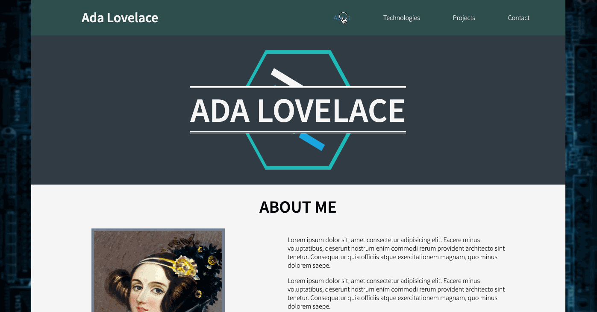
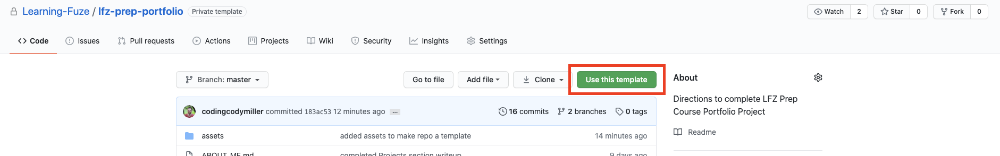
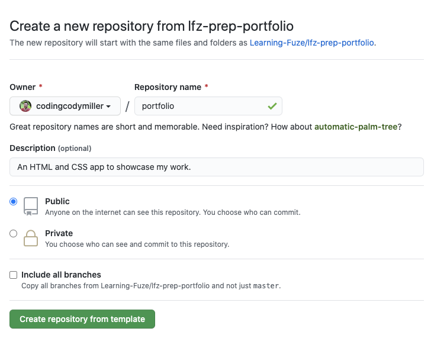
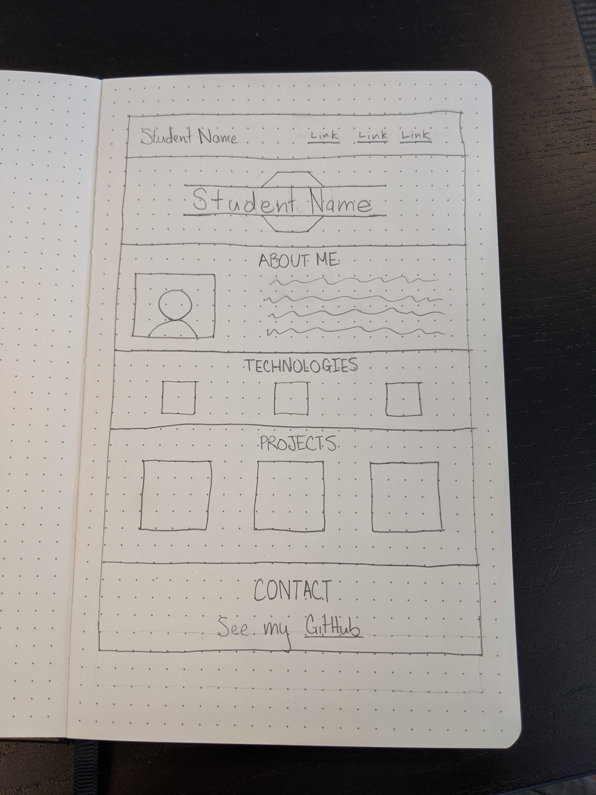
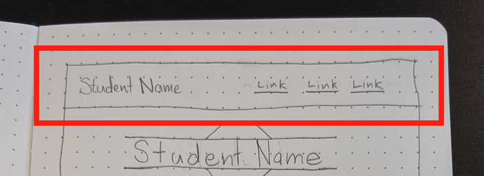

# LFZ Prep Course Portfolio

It is time to bring all the skills you've accrued together to tackle a challenge: building a full webpage layout from scratch. Specifically, we will be building a portfolio page describing yourself and some of your work. Here is an example of what we will be creating:

<p align="center">
  
</p>

## Getting Started

### Create a Repository

To begin, you'll need a GitHub repository to commit your code to. We will use this repository as a template, so that you can make your own repository with the files necessary for this project. There are steps below the following image to help you out.

1. Open [this link](https://github.com/Learning-Fuze/lfz-prep-portfolio) in a new tab, and click on the "Use This Template" button shown in the image below.
    <p align="center">
      
    </p>
1. You will be redirected to a new page which looks like this:
    <p align="center">
      
    </p>
1. Leave the **Owner** set to your own GitHub username.
1. Name your repository **`portfolio`** or something similar if you already have a `portfolio` repository.
1. Give it the following description: **An HTML and CSS page to showcase my work.**
1. Ensure the repository is set to **Public**.
1. Do **NOT** check the "Include all branches" checkbox.
1. Click the "Create repository from template" button.

### Clone the Repository

Once your GitHub repository has been created, you'll need to clone it to your computer with the `git` command.

1. Open your Terminal (on Mac) or Git Bash (on Windows).
1. Change to your `~/repos` directory with the following command:
    ```bash
    cd ~/repos
    ```
1. On your repository's GitHub page, find and click the **Clone** button.
1. Copy the URL that is displayed.
1. Back in your Terminal (Mac) or Git Bash (Windows), clone your repository with the `git clone` command. You'll need to paste the URL you copied instead of the example below.
    ```bash
    git clone https://github.com/username/portfolio
    ```
1. Then, change directories to your freshly cloned repository.
    ```bash
    cd portfolio
    ```
1. Lastly, open your new `portfolio` directory in your code editor!

With that done, we are now ready to begin the project!

## Making a Wireframe

When you are setting out to begin a new project, the first (*and most important!*) step in the development process is to ___plan___. Before we even touch code, the first step is to create a complete plan of what needs to be built, and how it should be built. Given that we want to make the portfolio page shown in the gif above, the first step in the planning process should be to make a visual representation of the page known as a [wireframe](https://en.wikipedia.org/wiki/Website_wireframe).

There are quite a few different approaches to making a wireframe, but the quickest and easiest way to make a simple wireframe is to draw it out on paper. Here is a drawing representing what we intend to make:

<p align="center">
  
</p>

Now that we have a visual representation of the application we intend to build, we can start thinking about features that need to be completed, and plan out the size and placement of elements on the page.


---
## <div align="center">🚨🚨🚨 **AN IMPORTANT NOTE ON ELEMENT SIZING** 🚨🚨🚨</div>

When setting out to determine the size an element should take in a page layout, a common mistake for new developers is to plan for both height and width of an element. As a general rule, you should anticipate how much ___width___ an element should take up, but except in specific cases, __the height of an element should be determined by the size of its content__.

Since height is effectively infinite in a webpage, elements should be allowed to take up as much height as they need to show their contents to the user. One of the rare exceptions to this rule is in situations where your element would not have size if it is not directly given a height, such as an element with a background image but no content inside the element. We will see this situation in practice over the course of this project, but it is important to know that manually setting the height of an element is oftentimes not the right path to follow, and should be avoided unless you have a compelling reason to do so.

---

Now that we are ready to begin planning out the sizing and placement of the elements in the application, it's time to decide on how we want to accomplish this. If we set out to build the entire page at the same time, that would be a humongous task that would likely lead to more stress than progress.

When setting out to plan out the specifics of a webpage layout, it is extremely helpful to **break the page down** into individual sections. Based upon the wireframe we constructed above, we have some very clearly separated sections that we can use to break this layout down into individual objectives to tackle.

<p align="center">
  
</p>

A good place to start would be the page header, as seen above. The header section takes up a full horizontal row of the webpage, which makes it an easy structure to consider separately from the rest of the document. In fact, the rest of this project would probably be much easier to tackle if we consider each section of the page to be its own separate task to break down. Given that, we now know how we want to divide up the workload:

## Portfolio Project Workflow
___
1. Header
1. Hero Image
1. About Me
1. Technologies
1. My Projects
1. Contact Me

___

Now that we have a plan of action, let's start working through the header in the next [section](HEADER.md).
