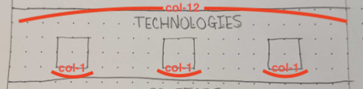
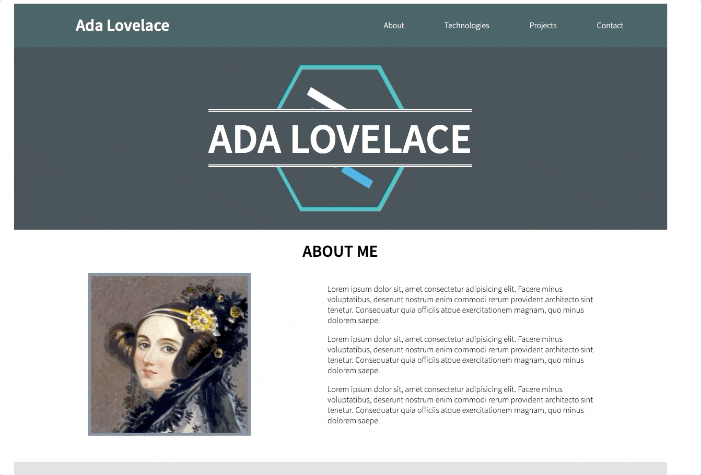

# Portfolio Technologies Section

For our next task, we will be working on building the "Technologies" section of the portfolio page. This section will show off what technologies you have experience with that you want to show off to prospective employers. At this point in your development journey, those technologies are HTML, CSS, and JavaScript. Let's take a look at the wireframe we created for the "Technologies" section:

<p align="center">
  
</p>

Based on this, we can see that there is a header declaring the purpose of the section which should take up the full width of the available space (col-12), and three boxes which are meant to represent images of each technology logo. The logo for each technology has been provided for you in the assets for this project. The images are very large, but they should be reasonably small on the actual page. As can be seen on the wireframe above, a measurement of `col-1` will keep them at a reasonable size, and we can space them out evenly in the extra space using the utility classes we have created previously. In fact, there is only one new piece of CSS that needs to be written for this section, so let's finish that up first!

# Technologies CSS

1. In your `style.css` document, create a new CSS rule-set selecting all elements with a class of `tech-section`.
1. In the CSS rule-set you created in the step above, add a `background-color` property with a value of `gainsboro`.
    - This class will be used to set the background color for this section.

And that's it! thanks to the magic of utility classes, all of the rest of the styling needed for this section already exists, and we can apply it to the HTML as it is built. Let's get started!

# Technologies HTML

1. Below the `div` element you created for the About section, create another `div` element.
1. This section has a link in the navbar as well, so we will need to supply an `id` for the element to correlate with the anchor tag in the nav. Add an `id` attribute with a value of "tech" to the div element created in the step above.
1. Since the CSS is already done for this section, we can apply all necessary classes to this element now! Here is each class we will add to this element, along with the reason for it:
    1. `row`
        - This div will act as a row in the portfolio page.
    1. `justify-evenly`
        - The `justify-evenly` class will evenly space out the technology logo images with extra room around them.
    1. `pb-50`
        - This will create some extra room on the bottom of the element to help separate it visually from the section below it.
    1. `tech-section`
        - This will apply the proper background color to this section.
1. Within the `div` element created above, create a child `h1` element with the text content "TECHNOLOGIES". Based on the wireframe above, we know that this element needs to take up the full width of this element, so apply a class of `col-12` as well.
1. As a sibling to the above `h1` element, create an `img` element. Additionally, please set the following attributes on this `img` element:
    - [`alt`](https://www.w3schools.com/tags/att_img_alt.asp) - set to a value of "HTML 5 logo"
    - [`src`](https://www.w3schools.com/tags/att_img_src.asp) - set to a [relative path](https://www.w3schools.com/html/html_filepaths.asp) leading to the `html-logo.png` image in the `assets` folder
    - `class` - Based on the sizing we decided for the image when examining the wireframe, add a class of `col-1` to set the width of this `img` element.
1. As a sibling to the above `img` element, create another `img` element. Additionally, please set the following attributes on this `img` element:
    - [`alt`](https://www.w3schools.com/tags/att_img_alt.asp) - set to a value of "CSS 3 logo"
    - [`src`](https://www.w3schools.com/tags/att_img_src.asp) - set to a [relative path](https://www.w3schools.com/html/html_filepaths.asp) leading to the `css-logo.png` image in the `assets` folder
    - `class` - Based on the sizing we decided for the image when examining the wireframe, add a class of `col-1` to set the width of this `img` element.
1. As a sibling to the above `img` element, create another `img` element. Additionally, please set the following attributes on this `img` element:
    - [`alt`](https://www.w3schools.com/tags/att_img_alt.asp) - set to a value of "Javascript logo"
    - [`src`](https://www.w3schools.com/tags/att_img_src.asp) - set to a [relative path](https://www.w3schools.com/html/html_filepaths.asp) leading to the `js-logo.png` image in the `assets` folder
    - `class` - Based on the sizing we decided for the image when examining the wireframe, add a class of `col-1` to set the width of this `img` element.

Believe it or not, that is all for this section! Open your document in the browser, and you should see the following:

<p align="center">
  
</p>

If so, you are ready to move on to the next section: [Projects](PROJECTS.md). If anything differs from the example above, cross-check your completed code with the code I have provided below before moving on.

# CODE QUALITY CHECK

With every step of this project, I will provide the completed code for what we have written at the bottom of the section as a reference. **PLEASE NOTE** that I am providing this code as a way for you to double check your completed code for each section after having written it. If you choose to copy my code without writing it yourself first, you are doing so at your own peril ☠️

`index.html` thus far:

```html
<!DOCTYPE html>
<html lang="en">

<head>
    <meta charset="UTF-8">
    <meta name="viewport" content="width=device-width, initial-scale=1.0">
    <title>Portfolio</title>
    <link href="https://fonts.googleapis.com/css?family=Source+Sans+Pro:300,600&display=swap" rel="stylesheet">
    <link rel="stylesheet" href="grid.css">
    <link rel="stylesheet" href="style.css">
</head>

<body>
    <div class="container text-align-center">
        <header class="row justify-between align-center white-text page-header">
            <h1 class="col-4">Ada Lovelace</h1>
            <nav class="row col-6 justify-evenly">
                <a href="#about" class="nav-item white-text">About</a>
                <a href="#tech" class="nav-item white-text">Technologies</a>
                <a href="#projects" class="nav-item white-text">Projects</a>
                <a href="#contact" class="nav-item white-text">Contact</a>
            </nav>
        </header>
        <div class="row justify-center align-center white-text hero-image">
            <h1 class="col-12 student-name">ADA LOVELACE</h1>
        </div>
    </div>
    <div id="about" class="row justify-evenly align-center pb-50 about-section">
        <h1 class="col-12">ABOUT ME</h1>
        
        <div class="col-5 text-align-reset">
            <p>Lorem ipsum dolor sit, amet consectetur adipisicing elit. Facere minus voluptatibus, deserunt nostrum enim commodi rerum provident architecto sint tenetur. Consequatur quia officiis atque exercitationem magnam, quo minus dolorem saepe.</p>
            <p>Lorem ipsum dolor sit, amet consectetur adipisicing elit. Facere minus voluptatibus, deserunt nostrum enim commodi rerum provident architecto sint tenetur. Consequatur quia officiis atque exercitationem magnam, quo minus dolorem saepe.</p>
            <p>Lorem ipsum dolor sit, amet consectetur adipisicing elit. Facere minus voluptatibus, deserunt nostrum enim commodi rerum provident architecto sint tenetur. Consequatur quia officiis atque exercitationem magnam, quo minus dolorem saepe.</p>
        </div>
    </div>
    <div id="tech" class="row justify-evenly pb-50 tech-section">
        <h1 class="col-12">TECHNOLOGIES</h1>
        
        
        
    </div>
</body>

</html>
```

`style.css` thus far:

```css
html {
    font-family: "Source Sans Pro", sans-serif;
}

.text-align-center {
    text-align: center;
}

.white-text {
    color: white;
}

.pb-50 {
    padding-bottom: 50px;
}

.justify-center {
    justify-content: center;
}

.justify-evenly {
    justify-content: space-evenly;
}

.justify-between {
    justify-content: space-between;
}

.align-center {
    align-items: center;
}

.page-header {
    background-color: darkslategrey;
}

.nav-item {
    text-decoration: none;
}

.nav-item:hover {
    color: steelblue;
}

.hero-image {
    background-color: #303b43;
    background-image: url(assets/lfz-logo.png);
    background-position: center;
    background-repeat: no-repeat;
    background-size: auto 80%;
    height: 350px;
}

.student-name {
    font-size: 80px;
    background-color: #303b43;
    border-top: 5px double white;
    border-bottom: 5px double white;
}

.about-section {
    background-color: whitesmoke;
}

.about-image {
    max-height: 80%;
    border: 6px solid slategray;
}

.text-align-reset {
    text-align: initial;
}

.tech-section {
    background-color: gainsboro;
}
```
